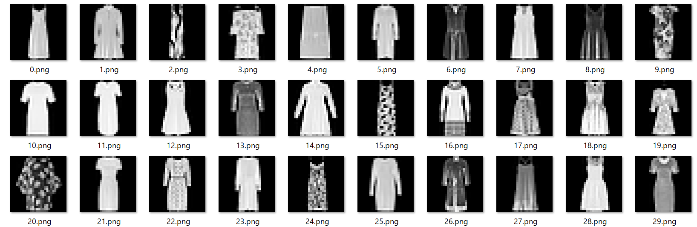

# Dump Fashion-MNIST data

Get Fashion-MNIST data and export them as png files.

## Usage


```sh
$ python fashion_mnist_dump.py 
```

This script will create following directories.

```txt
test
├ Bag
├ Boot
├ Coat
├ Dress
├ Pullover
├ Sandal
├ Shirt
├ Sneaker
├ Top
└ Trouser

train
├ Bag
├ Boot
├ Coat
├ Dress
├ Pullover
├ Sandal
├ Shirt
├ Sneaker
├ Top
└ Trouser
```

Each directory contains corresponding data as png files. You can see that the data are stored as sequential files.



## License

This software is released under the MIT License, see [LICENSE](LICENSE).# fashion_mnist_dump
